# EcoScan-ViT: Sistema de Monitoreo de Cobertura Forestal y Análisis Multitemporal

[](https://www.python.org/)
[](https://www.djangoproject.com/)
[](https://pytorch.org/)
[](https://earthengine.google.com/)

Este proyecto es una plataforma web científica y de Sistema de Información Geográfica (SIG) diseñada para la detección, monitoreo y análisis histórico de la cobertura forestal (deforestación y reforestación) en áreas de estudio de interés personalizado. A través de la integración de **Google Earth Engine (GEE)** y modelos avanzados de **Deep Learning (Vision Transformers)**, el sistema permite realizar clasificaciones multitemporales año con año.

---

## 🗺️ Arquitectura General del Sistema

El siguiente diagrama ilustra el flujo de datos e inferencia del sistema, desde la delimitación del área geográfica hasta la visualización en el tablero analítico:

```mermaid
graph TD
    A["Usuario dibuja área en Mapa / Sube Shapefile"] --> B["Django Backend (views.py)"]
    B -->|"Consulta GEE API"| C["Google Earth Engine GEE"]
    C -->|"Filtra colección y remueve nubes/bordes"| D["Colección Sentinel-2 / Landsat-8"]
    D -->|"Exporta GeoTIFF rasterizado"| E["Google Drive"]
    E -->|"Monitoreo y descarga vía PyDrive API"| F["Carpeta Local Temporal"]
    F -->|"Procesamiento con Rasterio y OpenCV"| G["Segmentación en Grilla de Inferencia"]
    G -->|"Normalización de bandas RGB a 8-bit"| H["Modelo PyTorch ViT-B/16 - Clasificador"]
    H -->|"Detección de clases: Bosque vs Otras"| I["Cálculo de Porcentajes de Suelo por Año"]
    I -->|"Guarda registros y rutas PNG"| J["Base de Datos SQLite3"]
    J -->|"Generación dinámica de curva de tendencia"| K["Dashboard de Evaluación Histórica"]
    K -->|"Visualización interactiva con Lightbox y Comparación"| L["Usuario Final"]
    style A fill:#2d1919,stroke:#4a1d1d,stroke-width:2px;
    style H fill:#192d1f,stroke:#1d4a2a,stroke-width:2px;
    style K fill:#1f2937,stroke:#374151,stroke-width:2px;
```



---

## ✨ Características Principales

- **Interfaz de Mapa Interactiva (Mapbox GL):** Equipado con herramientas de dibujo espacial (`Mapbox Draw`), un geocodificador para búsquedas rápidas de direcciones y soporte nativo para el trazado de polígonos complejos.
- **Carga de Datos Vectoriales (Shapefile):** Permite subir archivos vectoriales en formato comprimido (`.zip`) conteniendo las extensiones obligatorias de un shapefile (`.shp`, `.shx`, `.dbf`). El backend parsea la geometría y la proyecta automáticamente sobre el mapa interactivo.
- **Integración Robusta con GEE:** Descarga imágenes multiespectrales directamente de los almacenes satelitales en la nube:
  - **Sentinel-2:** Filtrado con máscaras de nubes dinámicas (`S2_CLOUD_PROBABILITY`) y procesamiento del borde de escena para remover píxeles defectuosos.
  - **Landsat 8 & Landsat 7:** Soporte para diferentes composiciones visuales (Color Verdadero, Infrarrojo de Ondas Cortas para Agricultura, Falso Color de vegetación y composición Urbana).
- **Pipeline de Clasificación por Deep Learning:**
  - **Segmentación Georreferenciada:** El polígono de estudio se divide en cuadrículas georreferenciadas homogéneas que cubren la zona en su totalidad.
  - **Clasificador Vision Transformer (ViT):** Se extrae cada cuadrícula, se convierte a escala de 8 bits y se clasifica de forma independiente utilizando un modelo **ViT-B/16** preentrenado y ajustado en 10 categorías de uso de suelo (bosques, áreas residenciales, cultivos, autopistas, etc.).
- **Tablero Analítico Multitemporal:**
  - **Visor en Pantalla Completa:** Permite desplegar las imágenes satelitales anuales a pantalla completa de manera instantánea (cambio de diapositivas inmediato, sin transiciones lentas).
  - **Gráfica de Tendencia Forestal:** Una curva temporal interactiva construida sobre la marcha con **Matplotlib** que muestra el incremento o disminución forestal interanual.
  - **Tabla Histórica Comparativa:** Genera automáticamente la tasa de cambio porcentual interanual respecto a la línea base.

---

## 🛠️ Tecnologías y Dependencias

El ecosistema tecnológico está compuesto por librerías especializadas en ciencia de datos, sistemas de información geográfica y aprendizaje profundo:

| Categoría                   | Tecnología                | Uso Principal                                                                                |
| :-------------------------- | :------------------------ | :------------------------------------------------------------------------------------------- |
| **Backend**                 | Django 4.2.x              | Framework de desarrollo de la aplicación web y gestión de rutas.                             |
| **IA / Deep Learning**      | PyTorch, Torchvision      | Motor de inferencia del clasificador Vision Transformer (ViT).                               |
| **SIG / Geoespacial**       | `earthengine-api`         | SDK para interacción y consultas a Google Earth Engine en la nube.                           |
| **Lectura Ráster**          | `rasterio`                | Lectura de imágenes GeoTIFF exportadas desde GEE con sus metadatos espaciales.               |
| **Manipulación Vectorial**  | `geopandas`, `shapely`    | Cálculo de centroides, envolturas convexas, áreas de cobertura e intersección de grillas.    |
| **Visión por Computadora**  | `opencv-python`           | Preprocesamiento de matrices de imágenes, normalización de contraste y codificación de PNGs. |
| **Automatización de Drive** | `pydrive2`                | Control de flujos de carga y descarga de imágenes desde Google Drive.                        |
| **Frontend**                | Bootstrap 5, Mapbox GL JS | Estructura responsiva, mapa interactivo y visualización premium con tema oscuro.             |

---

## 🗃️ Modelo de Datos (Esquema de BD)

La base de datos SQLite almacena las áreas delimitadas por los usuarios y las imágenes clasificadas de la serie temporal:

```
  ┌──────────────────┐          1:N          ┌─────────────────────┐
  │ ImagenSatelital  │──────────────────────>│  SubImagenSatelital  │
  ├──────────────────┤                       ├─────────────────────┤
  │ id (PK)          │                       │ id (PK)             │
  │ name             │                       │ imagen_id (FK)      │
  │ coordenadas      │                       │ subImagen (Image)   │
  │ satelite (FK)    │                       │ anio_imagen (Char)  │
  │ tipo_imagen (FK) │                       │ porcentaje (Char)   │
  └──────────────────┘                       └─────────────────────┘
```

---

## 📂 Estructura de Directorios del Proyecto

Para mantener el proyecto organizado y facilitar su mantenimiento, los archivos de datos geográficos e imágenes se estructuran bajo las siguientes carpetas principales:

- **`imagenes/`**
  - **`subimagen/`**: Imágenes recortadas procesadas por el sistema Django para visualización en el dashboard (excluidas en `.gitignore`).
  - **`descargas/`**: Carpeta donde se descargan de forma asíncrona los archivos de imágenes satelitales GeoTIFF (`.tif`) desde Google Drive para el análisis (excluido en `.gitignore`).
- **`shapefiles/`**
  - **`generated/`**: Contiene el archivo shapefile principal generado a partir de la geometría delimitada en el mapa por el usuario.
  - **`temp/`**: Almacena temporalmente los shapefiles subidos por los usuarios para su procesamiento y extracción.
  - **`examples/`**: Agrupa las colecciones de shapefiles históricos y de ejemplo (como `shapefile1`, `shapefile2`, `shapefile3`, `shapefiles10`) utilizados para pruebas de diagnóstico.

---

## 🔒 Seguridad y Aislamiento de Credenciales

El proyecto cuenta con un sistema de seguridad endurecido que evita la filtración accidental de secretos o claves API en repositorios públicos de GitHub o plataformas cloud:

- **Variables de Entorno (.env):** Toda la información sensible como la `SECRET_KEY` de Django, las configuraciones de `DEBUG` y las direcciones en `ALLOWED_HOSTS` han sido extraídas del código y se cargan dinámicamente mediante la librería `python-dotenv`.
- **Procesador de Contexto para APIs:** El token de Mapbox GL JS (`MAPBOX_ACCESS_TOKEN`) se inyecta dinámicamente desde el backend en las plantillas HTML a través de un procesador de contexto personalizado (`mapas/context_processors.py`), eliminando cualquier rastro de la clave en el código estático.
- **Control de Versiones Seguro (.gitignore):** Se configuraron exclusiones para la base de datos SQLite local (`db.sqlite3`), las credenciales de la API de Google Drive (`client_secrets.json`, `mycreds.txt`), las carpetas de datos temporales (`shapefiles/`, `imagenes/descargas/`), archivos temporales ráster (`.tif`) y directorios de caché de Python y entornos virtuales (`venv/`).

---

## 💻 Guía de Instalación y Despliegue Local

Sigue con atención estas instrucciones para configurar el proyecto en un entorno local compatible (macOS o Linux):

### 📋 Prerrequisitos de Sistema

Asegúrate de contar con las siguientes herramientas instaladas en tu sistema operativo:

- Python 3.9 o superior.
- C++ Compiler (requerido para compilar ciertas dependencias geoespaciales como `rasterio` y `shapely`).
- Librería GDAL (necesaria para el backend geoespacial). En macOS se instala fácilmente vía Homebrew: `brew install gdal`.

### 🚀 Pasos de Configuración

#### 1. Clonar el repositorio y acceder

```bash
git clone https://github.com/CarlosGaubert/EcoScan-ViT.git
cd EcoScan-ViT
```

#### 2. Crear y activar el entorno virtual

```bash
python3 -m venv venv
source venv/bin/activate
```

#### 3. Instalar dependencias requeridas

```bash
pip install --upgrade pip
pip install -r requirements.txt
```

#### 4. Autenticación e Inicialización de Google Earth Engine

El sistema requiere acceso a la API de GEE para realizar consultas geoespaciales. Ejecuta el comando de autenticación:

```bash
earthengine authenticate
```

_Este comando abrirá tu navegador predeterminado para que selecciones tu cuenta de Google aprobada en GEE y te otorgará un código de verificación que deberás copiar en la terminal._

#### 5. Configurar Variables de Entorno (.env)

El proyecto utiliza variables de entorno para aislar claves y configuraciones críticas del código fuente:

1. Copia el archivo de plantilla de ejemplo:
   ```bash
   cp .env.example .env
   ```
2. Abre el archivo `.env` creado y configura tus claves personalizadas (como tu `SECRET_KEY` de Django y tu `MAPBOX_ACCESS_TOKEN` para la visualización del mapa).

#### 6. Configuración de API de Google Drive (`client_secrets.json`)

El sistema utiliza Google Drive como puente intermedio para exportar los GeoTIFFs pesados desde GEE y descargarlos localmente de manera asíncrona:

1.  Ingresa a la [Google Cloud Console](https://console.cloud.google.com/).
2.  Crea un nuevo proyecto y habilita la **Google Drive API**.
3.  Crea credenciales de tipo **OAuth 2.0 Client ID** (elige aplicación de escritorio).
4.  Descarga el archivo de credenciales en formato JSON, renombralo a **`client_secrets.json`** y colócalo directamente en la raíz de este proyecto.
5.  Crea una carpeta en tu Google Drive donde se depositarán las imágenes temporales y copia su ID. Pega este ID en el archivo `mapas/function_analisys.py` (dentro de las funciones de carga de Drive).

#### 7. Migrar la Base de Datos e Iniciar Servidor

```bash
python manage.py migrate
python manage.py runserver
```

Una vez iniciado, abre tu navegador e ingresa a **`http://127.0.0.1:8000/`** para comenzar a interactuar con el mapa.

---

## 🔍 Pipeline de Clasificación de Bosques

1.  **Detección de Geometría:** El sistema toma las coordenadas del polígono (ya sea de Mapbox o del archivo Shapefile) y las procesa usando `shapely`.
2.  **Exportación Asíncrona (GEE):** Se define la colección satelital para cada año de la serie temporal (2018–2026), se extraen las bandas necesarias, se genera un compuesto de mediana corregida por nubes/bordes y se envía una tarea de exportación (`ee.batch.Export.image.toDrive`) a Google Drive.
3.  **Descarga Automática:** El backend realiza un sondeo continuo (polling) hasta que la tarea en GEE finaliza, tras lo cual utiliza la API de Google Drive para ubicar y descargar el archivo GeoTIFF a la carpeta local del servidor.
4.  **Inferencia ViT (PyTorch):**
    - La imagen multiespectral es leída con `rasterio` y convertida a una representación de 8 bits adecuada para visualización RGB.
    - Se calcula una grilla de rectángulos espaciales dentro de la envoltura de la geometría.
    - Las celdas de la grilla que caen dentro del polígono del usuario en más de un 90% de su área son segmentadas en parches.
    - Cada parche es alimentado al modelo **ViT-B/16** cargado en memoria (`ViT_Satellite.pth`). Si la clasificación predicha tiene el ID correspondiente a bosque, se acumula su superficie.
5.  **Actualización de Resultados:** Al concluir los análisis interanuales, el servidor genera el gráfico de decrecimiento de bosque con Matplotlib y renderiza el Dashboard en tiempo real.
